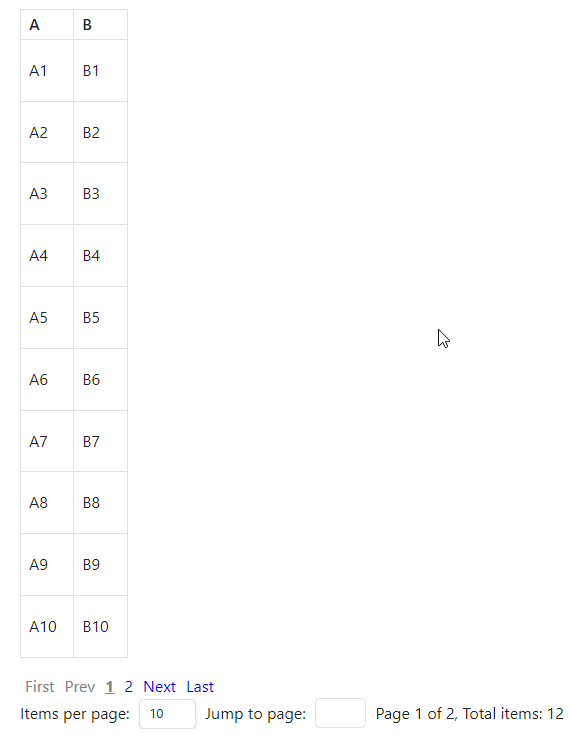

# Dataview

<https://github.com/blacksmithgu/obsidian-dataview/>

Advanced queries over your vault for the data-obsessed.

Плагин, предназначенный для обработки данных из заметок, фактически позволяет создавать базу данных внутри `Obsidian`.

- [Документация](https://blacksmithgu.github.io/obsidian-dataview/)
- [Obsidian Example Vault for Dataview Queries](https://github.com/s-blu/obsidian_dataview_example_vault)
- [Basic Dataview Query Builder](https://s-blu.github.io/basic-dataview-query-builder/)
- [ChatGPT - DataviewJS (Obsidian) Snippets](https://chatgpt.com/g/g-JuOzi3RXI-dataviewjs-obsidian-snippets)

## Пагинация

Используя такую функцию можно добиться пагинации (разбиения на страницы)



````markdown
```dataviewjs
renderPaginatedTable({
  dv,
  headers: ["A", "B"],
  rows: [
    ["A1", "B1"],
    ["A2", "B2"],
    ["A3", "B3"],
    ["A4", "B4"],
    ["A5", "B5"],
    ["A6", "B6"],
    ["A7", "B7"],
    ["A8", "B8"],
    ["A9", "B9"],
    ["A10", "B10"],
    ["A11", "B11"],
    ["A12", "B12"]
  ]
});
```
````

```js
function renderPaginatedTable({
  dv,
  headers,
  rows,
  itemsPerPageOptions = [10, 20, 50, 100]
}) {
  let css = `
.pagination .page-link.disabled {
  pointer-events: none;
  color: gray;
}

.pagination .page-link {
  margin: 0 5px;
  cursor: pointer;
  text-decoration: none;
  color: blue;
}

.pagination .page-link:hover:not(.disabled) {
  text-decoration: underline;
}
.pagination .page-link.current {
  font-weight: bold;
  text-decoration: underline;
}

.pagination select,
.pagination input {
  margin: 0 5px;
}
`;

  let itemsPerPage = itemsPerPageOptions[0];
  let totalPages = Math.ceil(rows.length / itemsPerPage);
  const initialPage = parseInt(window.location.hash.replace("#", "")) || 1;
  renderPage(initialPage);
  function createPaginationControls(pageNumber) {
    const paginationDiv = dv.container.createEl("div", { cls: "pagination" });
    const paginationRow1Div = paginationDiv.createDiv();
    createPageLink("First", 1, pageNumber === 1);
    createPageLink("Prev", pageNumber - 1, pageNumber === 1);
    if (pageNumber > 3) {
      paginationRow1Div.createEl("span", { text: "..." });
    }
    for (let i = Math.max(1, pageNumber - 2); i <= Math.min(totalPages, pageNumber + 2); i++) {
      const pageLink = createPageLink(i.toString(), i, i === pageNumber);
      if (i === pageNumber) {
        pageLink.addClass("current");
      }
    }
    if (pageNumber < totalPages - 2) {
      paginationRow1Div.createEl("span", { text: "..." });
    }
    createPageLink("Next", pageNumber + 1, pageNumber === totalPages);
    createPageLink("Last", totalPages, pageNumber === totalPages);
    const paginationRow2Div = paginationDiv.createDiv();
    paginationRow2Div.createEl("span", { text: ` Items per page: ` });
    const itemsPerPageSelect = paginationRow2Div.createEl("select");
    itemsPerPageOptions.forEach((option) => {
      itemsPerPageSelect.createEl("option", { text: option.toString(), value: option.toString() });
    });
    itemsPerPageSelect.value = itemsPerPage.toString();
    itemsPerPageSelect.addEventListener("change", () => {
      itemsPerPage = parseInt(itemsPerPageSelect.value);
      totalPages = Math.ceil(rows.length / itemsPerPage);
      renderPage(1);
    });
    paginationRow2Div.createEl("span", { text: `  Jump to page: ` });
    const jumpToPageInput = paginationRow2Div.createEl("input", { type: "number", attr: { min: 1, max: totalPages } });
    jumpToPageInput.addEventListener("keydown", (event) => {
      if (event.key === "Enter") {
        const page = parseInt(jumpToPageInput.value);
        if (page >= 1 && page <= totalPages) {
          renderPage(page);
        }
      }
    });
    paginationRow2Div.createEl("span", { text: `  Page ${pageNumber} of ${totalPages}, Total items: ${rows.length}` });
    function createPageLink(text, pageNumber2, disabled = false) {
      const link = paginationRow1Div.createEl("a", { cls: "page-link", text, href: `#${pageNumber2}` });
      if (disabled) {
        link.addClass("disabled");
        link.onclick = (event) => event.preventDefault();
      } else {
        link.addEventListener("click", (event) => {
          event.preventDefault();
          renderPage(pageNumber2);
        });
      }
      return link;
    }
    ;
  }
  function renderPage(pageNumber) {
    dv.container.empty();
    dv.container.createEl("style", { text: css });
    const startIndex = (pageNumber - 1) * itemsPerPage;
    const endIndex = startIndex + itemsPerPage;
    const rowsForCurrentPage = rows.slice(startIndex, endIndex);
    const table = dv.container.createEl("table");
    const headerRow = table.createEl("tr");
    headers.forEach((headerText) => {
      headerRow.createEl("th", { text: headerText });
    });
    rowsForCurrentPage.forEach((row) => {
      const tableRow = table.createEl("tr");
      row.forEach((cell) => {
        const cellEl = tableRow.createEl("td");
        dv.paragraph(cell, { container: cellEl });
      });
    });
    createPaginationControls(pageNumber);
  }
}
```
